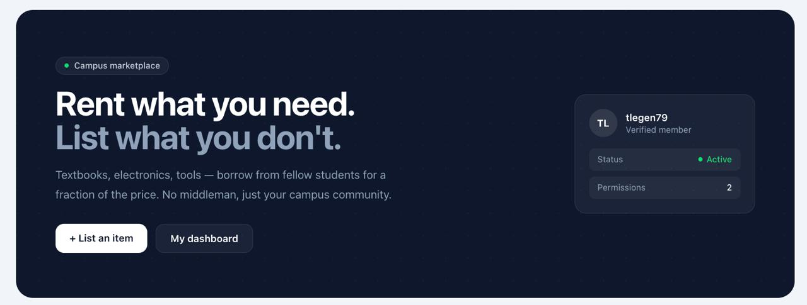
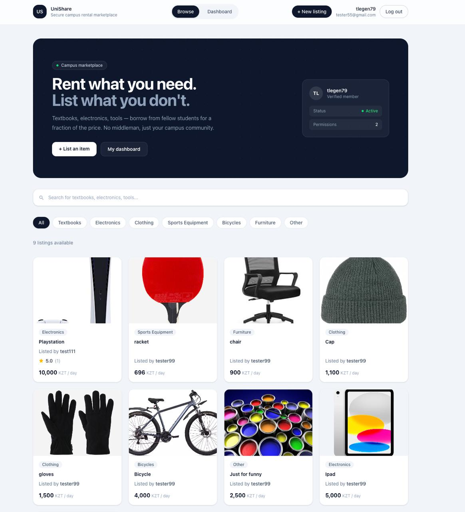
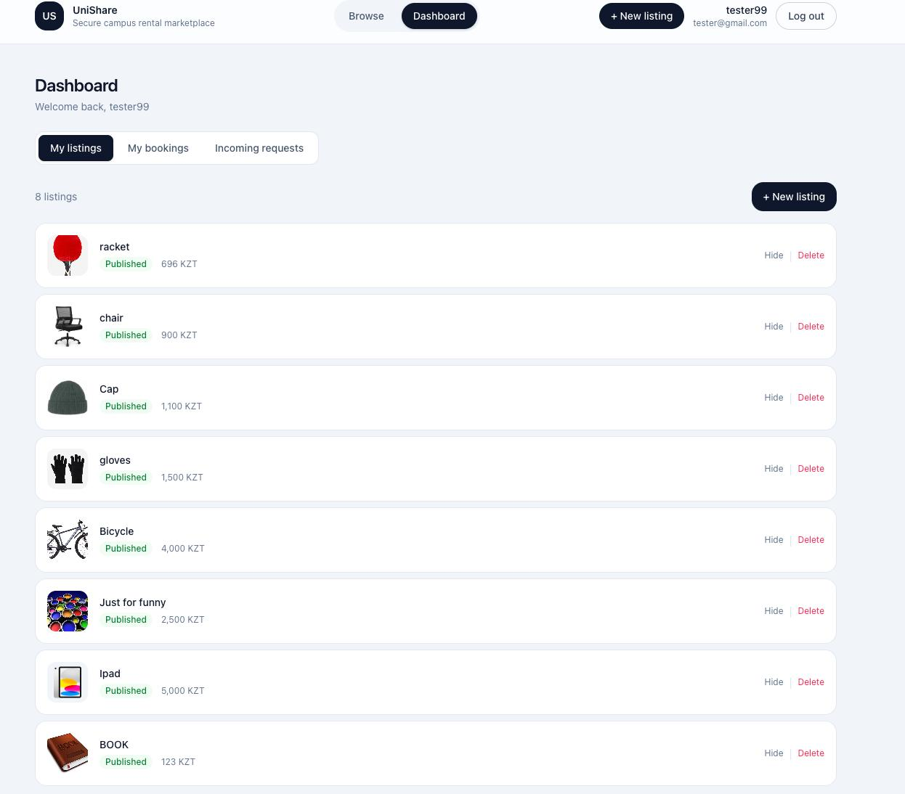
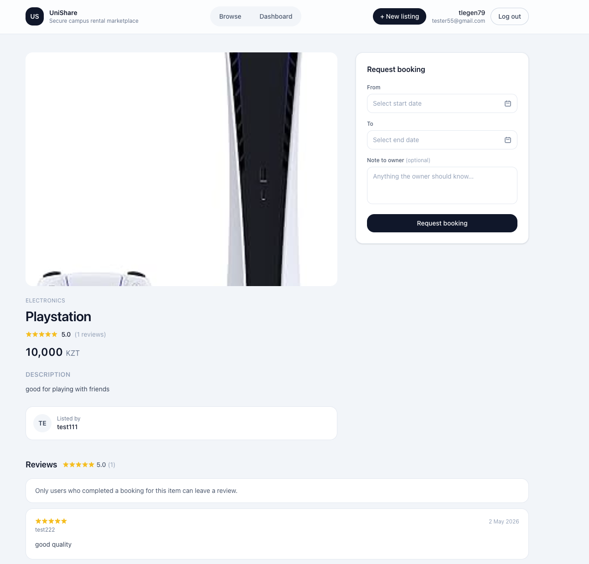

<div align="center">

<br/>

<picture>
  <source media="(prefers-color-scheme: light)" srcset="assets/logo-light.png">
  
</picture>

<h1>UniShare</h1>

<p><strong>Campus peer-to-peer rental marketplace for students</strong><br/>
Rent a textbook for a week. Lend your camera over break. Stop buying things you'll use twice.</p>

<br/>

[](https://openjdk.org/projects/jdk/17/)
[](https://spring.io/projects/spring-boot)
[](https://react.dev)
[](https://www.postgresql.org)
[](https://tailwindcss.com)
[](LICENSE)

<br/>

[**Demo**](#screenshots) · [**Swagger UI**](http://localhost:8080/swagger-ui/index.html) · [**Report a Bug**](https://github.com/Aqyn97/UniShare/issues/new) · [**Request a Feature**](https://github.com/Aqyn97/UniShare/issues/new)

<br/>



<br/><br/>

</div>

---

## The problem

A 2000KZT textbook for one semester.An 800KZT calculator needed for one midterm A camera kit sitting untouched for 11 months

Campus stores don't help. Facebook Marketplace is a gamble. UniShare is the missing layer — students listing what they have, other students renting what they need, with a full booking workflow built in so nothing falls apart in someone's DMs

---

## Table of contents

- [Screenshots](#screenshots)
- [Features](#features)
- [Tech stack](#tech-stack)
- [Installation](#installation)
- [Usage](#usage)
- [Project structure](#project-structure)
- [API docs](#api-docs)
- [Team](#team)

---

## Screenshots

<div align="center">

| Home | Dashboard | Booking |
|:---:|:---:|:---:|
|  |  |  |

</div>


---

## Features

For renters
- Search and filter listings by category, keyword, and availability
- Send a booking request with a date range and a message to the owner
- Track the rental from request to return
- Leave a review after it's done

For listers
- Create listings with photos, a description, and pricing
- Approve or reject incoming booking requests
- Confirm handover and return — every stage is recorded
- Publish, hide, or delete listings whenever you want

Platform-wide
- Session-based authentication (no tokens floating in localStorage)
- Email confirmation on sign-up, secure password reset via email link
- Admin panel for user and item moderation, platform statistics
- Full Swagger UI — every endpoint is documented and testable without any setup

---

## Tech stack

| Layer | Technologies |
|---|---|
| Backend | Java 17, Spring Boot 3, Spring Security, Spring Data JPA, Flyway |
| Database | PostgreSQL 16 |
| Frontend | React 18, TypeScript, Vite, React Router v6 |
| Data layer | Axios, TanStack Query, React Hook Form, Zod |
| Styling | Tailwind CSS |
| Images | Cloudinary |
| API docs | Springdoc OpenAPI / Swagger UI |
| Tooling | Gradle, npm, Docker Compose |

---

## Installation

### What you need first

- [Java 17](https://adoptium.net/)
- [Node.js 18+](https://nodejs.org/) and npm
- [Docker Desktop](https://www.docker.com/products/docker-desktop/)

### Step 1 — Clone

```bash
git clone https://github.com/Aqyn97/UniShare.git
cd UniShare
```

### Step 2 — Start the database

```bash
docker compose up -d
```

PostgreSQL will be running on `localhost:5433`.

### Step 3 — Set up environment variables

Create a `.env` file in the project root:

```env
# Database
SPRING_DATASOURCE_URL=jdbc:postgresql://localhost:5433/pm_project_db
SPRING_DATASOURCE_USERNAME=postgres
SPRING_DATASOURCE_PASSWORD=postgres

# Auth & Email
APP_AUTH_FRONTEND_BASE_URL=http://localhost:5173
APP_AUTH_EMAIL_ENABLED=true
APP_AUTH_MAIL_MODE=log
APP_AUTH_MAIL_FROM=no-reply@unishare.local

# Cloudinary
CLOUDINARY_CLOUD_NAME=your_cloud_name
CLOUDINARY_API_KEY=your_api_key
CLOUDINARY_API_SECRET=your_api_secret
```

> `APP_AUTH_MAIL_MODE=log` — confirmation and password reset links print to the backend console instead of sending real emails. This is the easiest option for local development.

<details>
<summary>Want real outbound emails? Expand for SMTP config.</summary>

```env
APP_AUTH_MAIL_MODE=smtp
APP_AUTH_MAIL_FROM=no-reply@yourdomain.com
SPRING_MAIL_HOST=smtp.gmail.com
SPRING_MAIL_PORT=587
SPRING_MAIL_USERNAME=your_email@gmail.com
SPRING_MAIL_PASSWORD=your_app_password
SPRING_MAIL_PROPERTIES_MAIL_SMTP_AUTH=true
SPRING_MAIL_PROPERTIES_MAIL_SMTP_STARTTLS_ENABLE=true
```

</details>

<details>
<summary>Want to skip email verification entirely for dev? Expand here.</summary>

Set `APP_AUTH_EMAIL_ENABLED=false`. Accounts skip verification, sign-in is immediate, and all email endpoints are disabled. Restart both the backend and frontend after changing this.

</details>

### Step 4 — Start the backend

```bash
./gradlew bootRun
```

Runs on `http://localhost:8080`. Flyway applies all database migrations automatically on first start.

### Step 5 — Start the frontend

```bash
cd frontend
npm install
npm run dev
```

Runs on `http://localhost:5173`. Open it in your browser.

---

## Usage

1. Register a new account
2. Confirm your email
   - Using `APP_AUTH_MAIL_MODE=log`? Copy the link from the backend console
3. Sign in
4. Browse listings from the home page
5. Create your own listing from the dashboard
6. Send booking requests — track them through to return

---

## Project structure

```
UniShare/
├── src/
│   └── main/
│       ├── java/               # Spring Boot app (controllers, services, repos)
│       └── resources/
│           └── db/migration/   # Flyway SQL migrations
├── frontend/
│   └── src/
│       ├── components/         # Reusable UI components
│       ├── pages/              # Route-level views
│       ├── api/                # Axios client + TanStack Query hooks
│       └── types/              # TypeScript types
├── docs/
│   └── api/                    # Postman collection
├── tests/                      # Reserved for future tests
├── assets/                     # Screenshots and media
├── docker-compose.yml
├── build.gradle
├── .gitignore
├── LICENSE
└── README.md
```

---

## API docs

The full API is documented with Springdoc OpenAPI. Every endpoint is explorable and testable directly in the browser.

- Swagger UI → https://adventurous-reprieve-production-7ee3.up.railway.app/swagger-ui/index.html
- Postman collection → `docs/api/unishare-postman-collection.json`

---

## Team

| Name | Student ID |
|---|---|
| Tolegen Nurdaulet | 230103104 |
| Sultan Assimbek | 230103379 |
| Aman Kalabay | 230103375 |
| Tulegen Yerassyl | 230103342 |

---

<div align="center">
<sub>Built by students, for students.</sub>
</div>
